# Laboratoire pratique 0102 : Synchronisation des identités à l'aide de Microsoft Entra Connect

## 🧩 Scénario

Contoso Corporation gérait les utilisateurs séparément dans **AD DS** et **Microsoft Entra ID**, ce qui entraînait des incohérences et une gestion inefficace.  
L’objectif de ce lab est de **connecter les deux annuaires** à l’aide de **Microsoft Entra Connect** afin de centraliser la gestion des identités.

## Task 1 – Configuration de la synchronisation avec Microsoft Entra Connect

🎯 Objectif

Configurer la synchronisation d’annuaire entre Active Directory on-premises et Microsoft Entra ID à l’aide de Microsoft Entra Connect Sync.

## Task 1.1  Installation d’Active Directory Domain Services et création de la forêt

1. Installation du rôle Active Directory Domain Services  
3. Promotion du serveur en contrôleur de domaine (création de la forêt)   
5. Vérification du domaine et du contrôleur de domaine  
7. Installation et démarrage de Microsoft Entra Connect Sync
9. Configuration du compte de forêt Active Directory
    
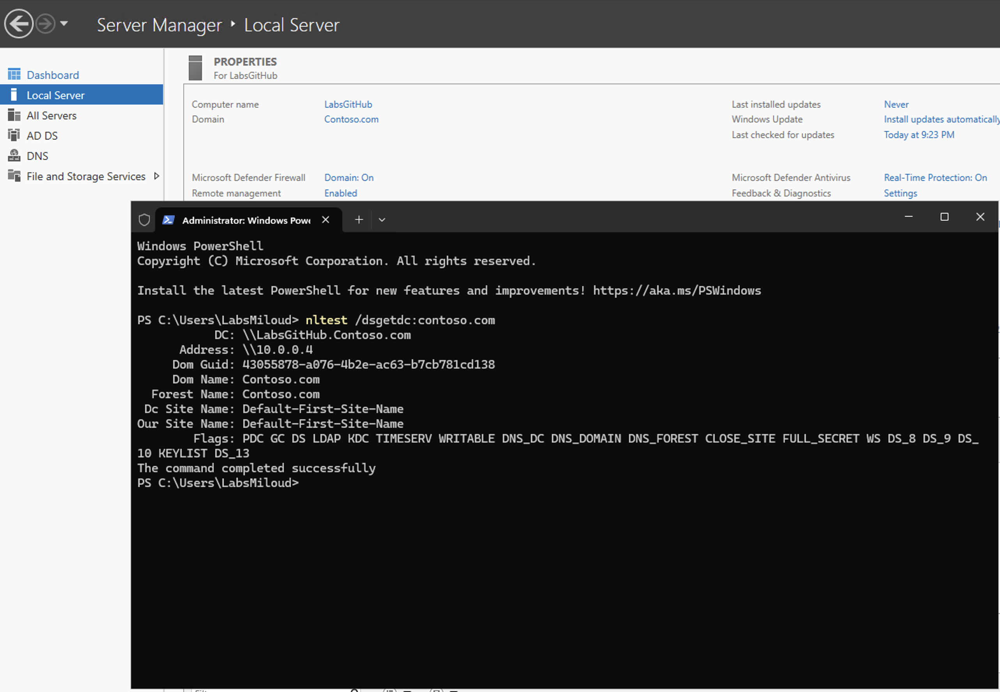

1. Accès à Entra Connect
- Conexion au *Microsoft Entra Admin Center*
- *Entra ID > Entra Connect*
- Onglet Manage
- Télécharger *Connect Sync Agent*
  
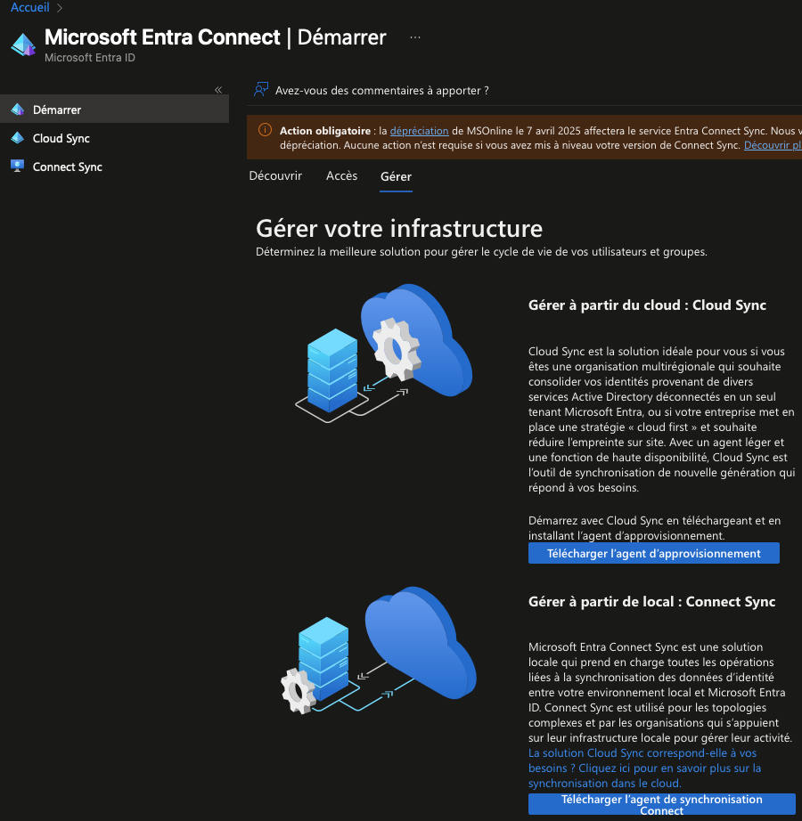

2. Installation de Microsoft Entra Connect
  - Lancer AzureAdConnect.msi
  - Accepter les termes
  - Mode *Customize*
  - Installer les composants requis.
    
    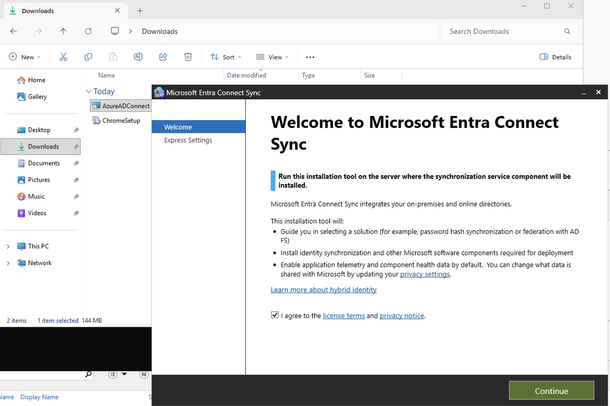
    
3. Configuration de l'authentification
  - Méthode: *Password Hash Synchronization*
  - Connexion avec le compte elmiloudlarhlid@labsm365.onmicrosoft.com
    
   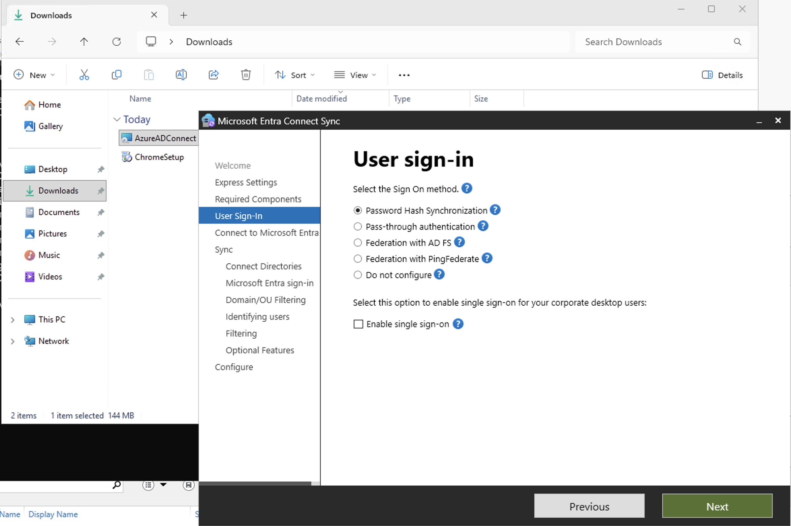
  
4. Connexion à l'Active Directory
 - Connexion à Microsoft Entra ID
 - Connexion à Active Directory (Contoso.com)
   
  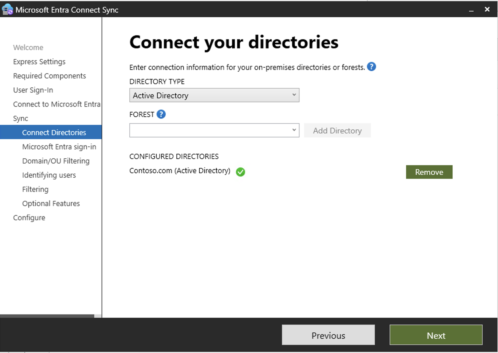
  
7. Finalisation
   
 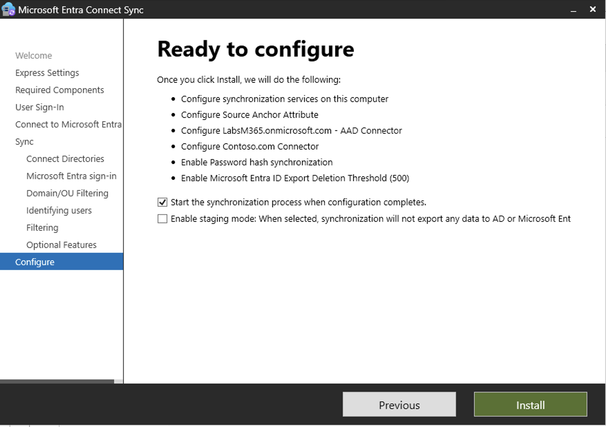
 
 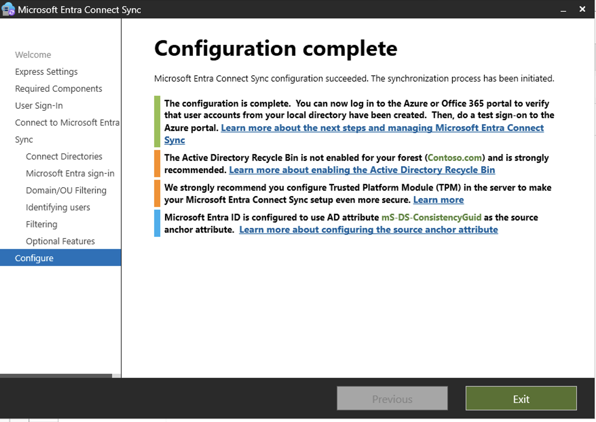

## Task 2 – Vérification de la synchronisation dans Microsoft Entra ID

🎯 Objectif

Vérifier que les utilisateurs et groupes Active Directory on-premises sont correctement synchronisés vers Microsoft Entra ID.

-Avant de vérifier la synchronisation, je vais créer les utilisateurs et les groupes dans mon AD afin de pouvoir les synchroniser avec mon Entra.

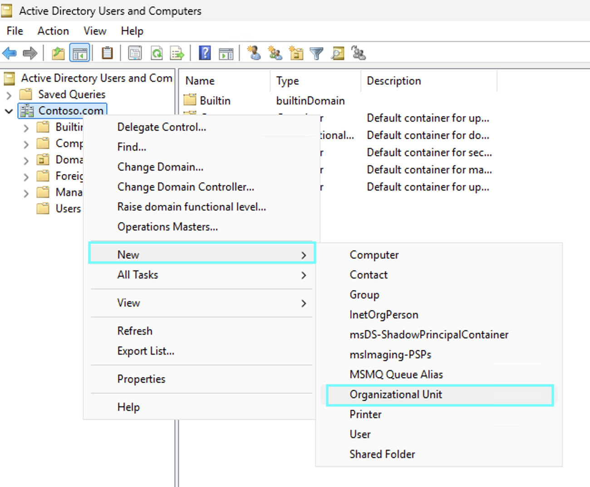

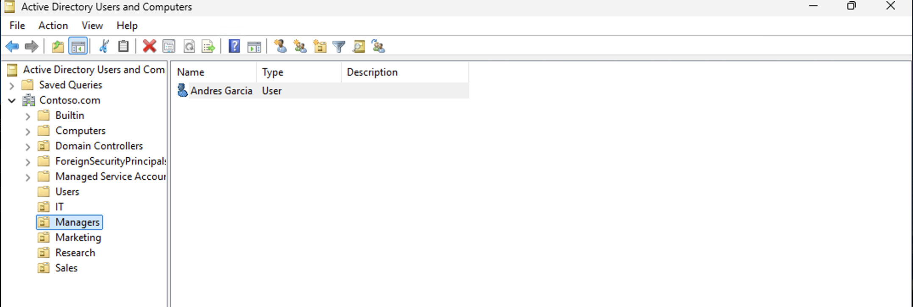

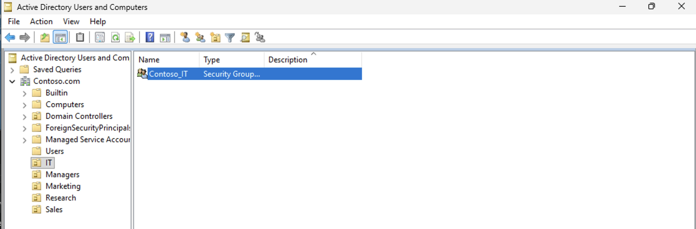

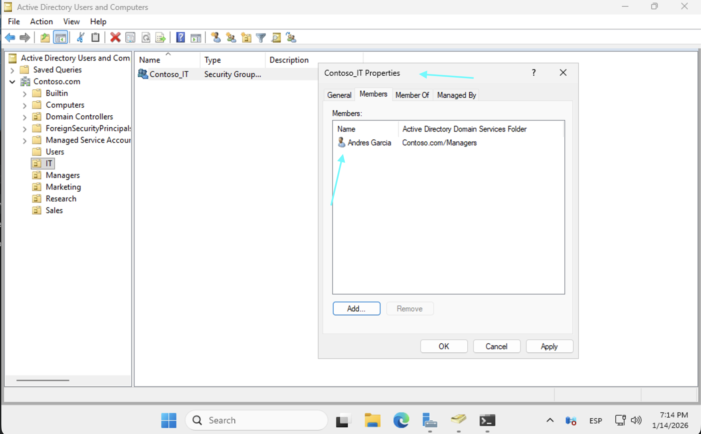

- Pour forcer la synchronisation entre mon AD et mon entra, j'exécuterai la commande suivante dans la console :

1. Accès au Microsoft Entra Admin Center.
2. Vérification des utilisateurs synchronisés
   - Menu *Users*
   - Présence des utilisateurs issus d'*AD DS*
   - Colonne *On-premises sync enabled = yes*
     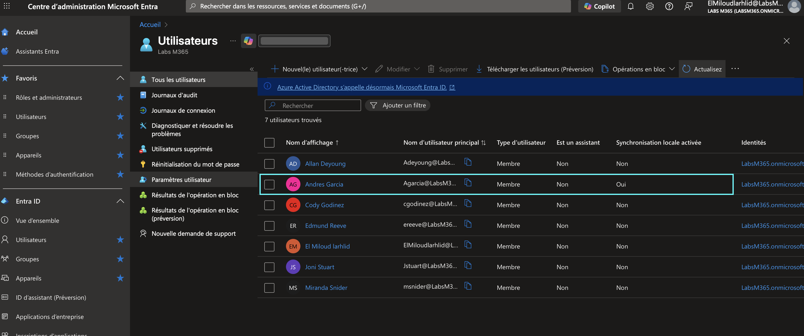
3. Vérification des groupes synchronisés
   - Menu *Groups > All groups*
   - Groupes issus d'*AD DS*
   - Colonne *Source = windows Server AD*
     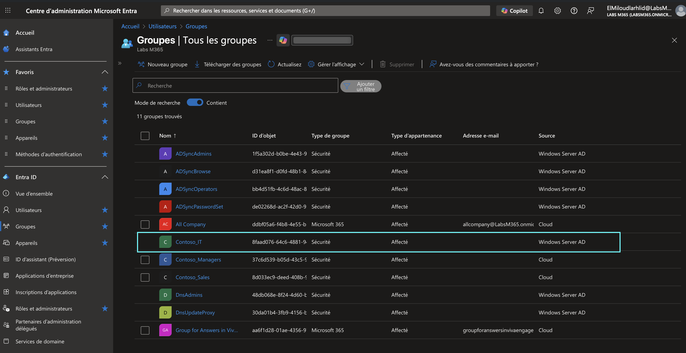
4. Vérification d'un groupe synchronisé
   - Sélection du groupe *Managers*
   - Membres visibles
   - Modification impossible (source AD on-premises)
     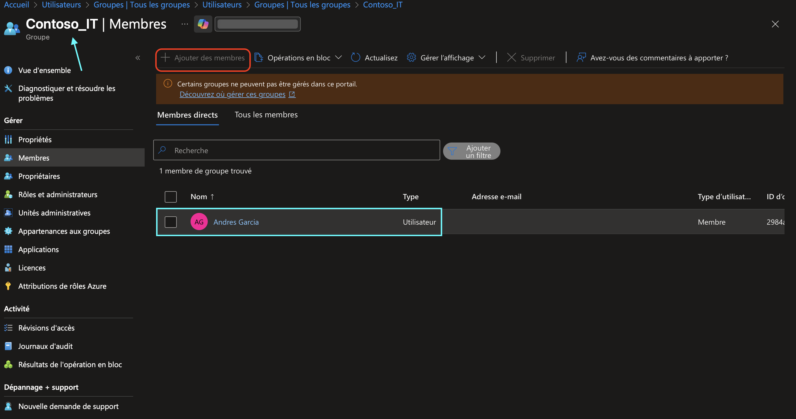

