# Laboratoire pratique 03 : Configuration et gestion d'Entra Join

## Exercise 1 – Configuration de Microsoft Entra Join

### 🎯 Objectif du laboratoire

Ce laboratoire a pour objectif de configurer les paramètres des appareils dans Microsoft Entra ID afin de permettre l’inscription des postes Windows dans l’environnement cloud de l’entreprise, tout en appliquant des règles de sécurité et de gouvernance des appareils.

- Les actions réalisées incluent :

- L’autorisation pour tous les utilisateurs de joindre des appareils à Entra ID

- La limitation du nombre maximal d’appareils par utilisateur

- L’attribution de droits d’administrateur local sur tous les appareils Entra join

- L’activation de l’authentification multifacteur par SMS

- La validation du processus de Microsoft Entra Join

## Exercise 1 – Configuration de Microsoft Entra Join
1. Connexion au centre d'administration Microsoft Entra (https://entra.microsoft.com) avec un compte administrateur.
2. Configuration des paramètres suivants:
 - * Users may join devices to Microsoft Entra ID: * All*
 - * Require MFA to register or join devices: * No
 - * Maximum number of devices per user: * 20
     
   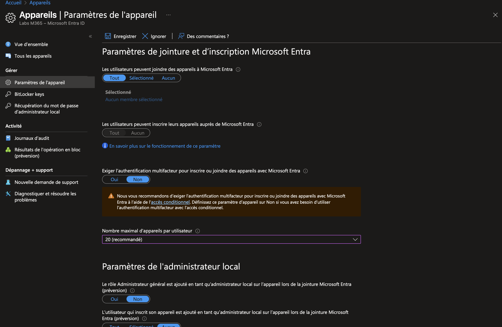
   
3. Configuration des administrateurs locaux des appareils Entra join:
   - Accès à * Local administrator settings *
   - Ajout de l'utilisateur * Allan Deyoung * via le rôle Device Administrator
     
      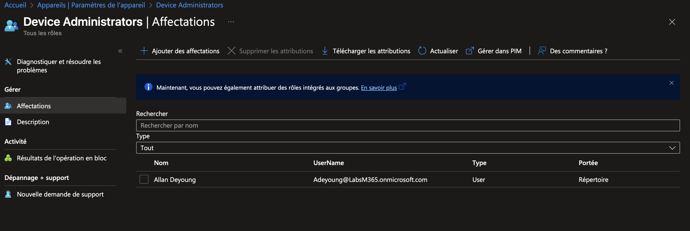
     
4. Enregistrement des paramètres.
   
  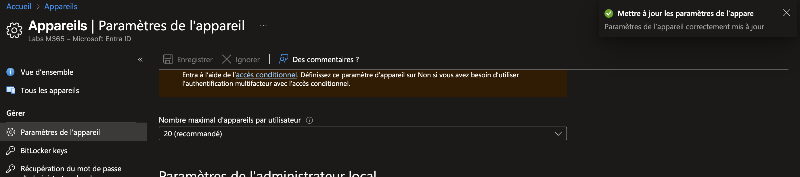
 
6. Activation de l'authentification par SMS:
 - *Authentication methods > * SMS *
   
  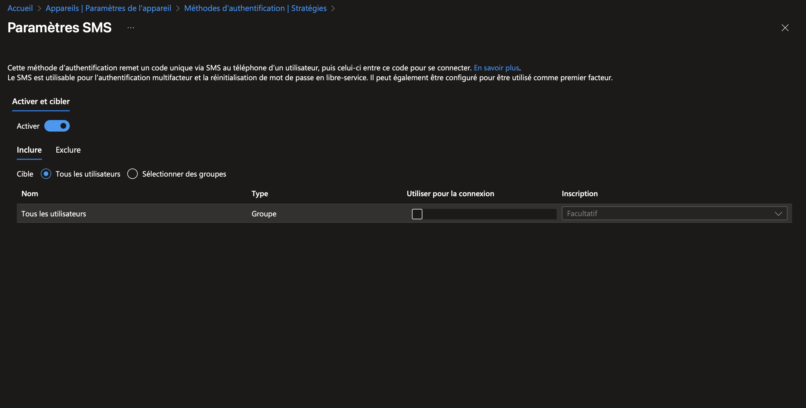

### Tâche 2 : Effectuer une jointure Entra
1. Switch to SEA-WS1 and sign in as Admin with the password of Pa55w.rd.
2. On the Accounts page, select Access work or school.
3. On the Sign in page, type Jstuart@LabsM365.onmicrosoft.com and then select Next.
4. On the Make sure this is your organization dialog box, select Join.
5. On the Access work or school page, verify that Connected to Contoso's Azure AD is displayed.
   
   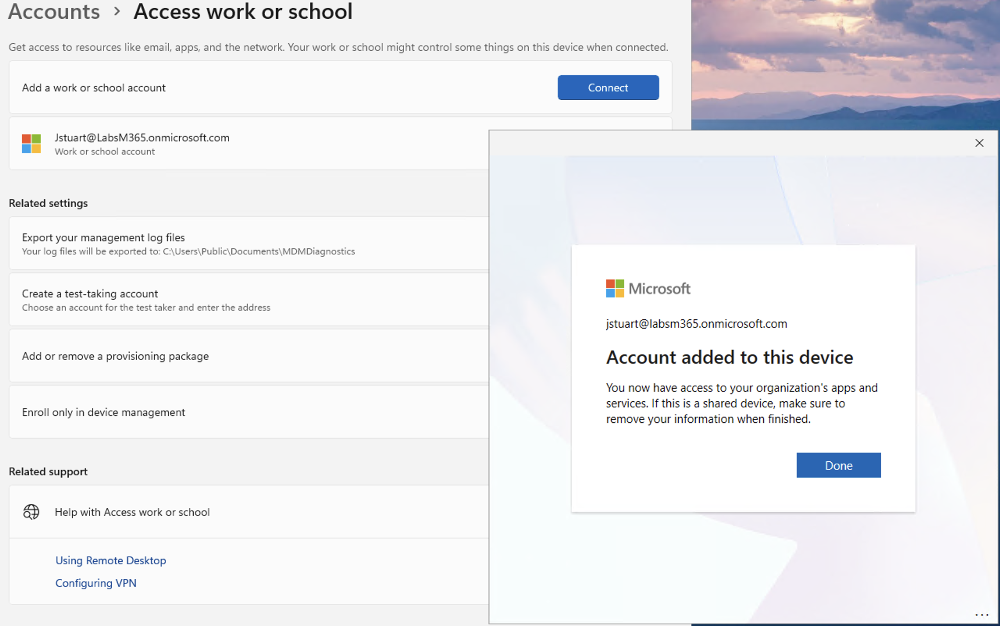

### Tâche 3 : Valider Entra Join
1. Dans la console PowerShell, tapez ce qui suit et appuyez sur Entrée : dsregcmd /status
   
   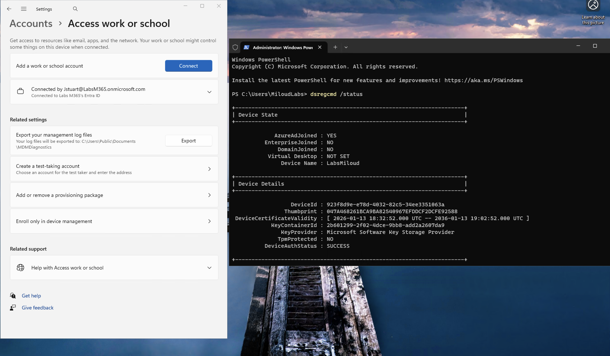

   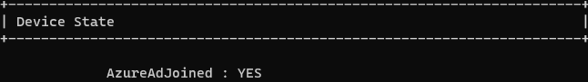
  
3. Dans Gestion de l'ordinateur, développez Utilisateurs et groupes locaux, puis sélectionnez Groupes.

   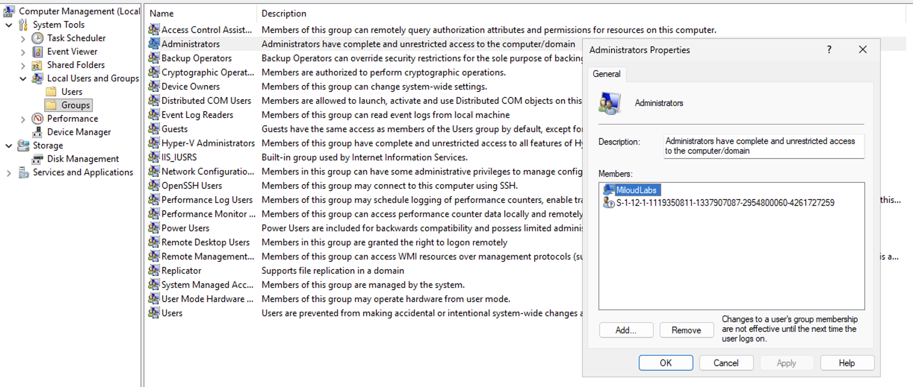
   
5. Switch to SEA-SVR1.
6. In Microsoft Edge, in the Microsoft Entra admin center, select Devices, and then select All devices.

   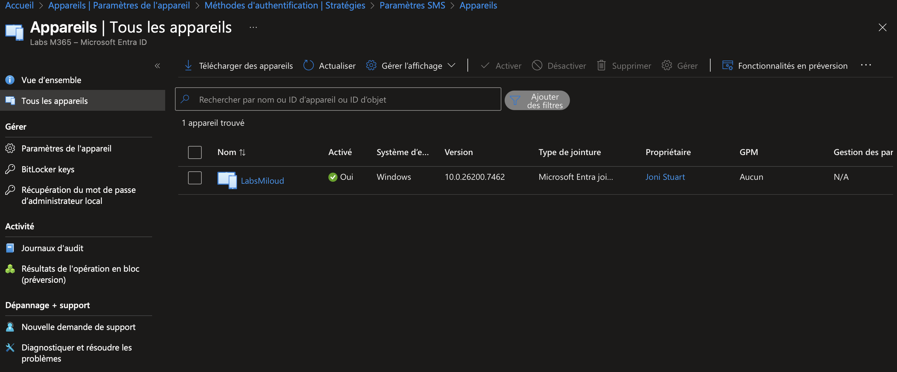
   
8. Verify that the Join Type is listed as Microsoft Entra joined and that the owner is Joni Stuart.

   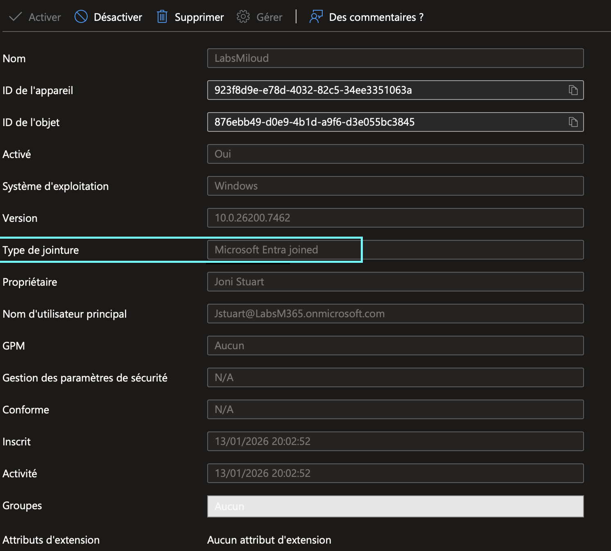

### Tâche 4 - Connexion à Windows avec un utilisateur Microsoft Entra ID

1. Sur le poste SEA-WS1, connexion à Windows avec l’utilisateur JoniS@yourtenant.onmicrosoft.com
 à l’aide du mot de passe du tenant.
2. Attente de la création automatique du profil utilisateur.
3. Validation de l’utilisation de Windows Hello pour le compte Entra ID.
4. Configuration de la sécurisation du compte :
   - Sélection de I want to set up a different method
   - Choix de la méthode Phone pour l’authentification
5. Saisie d’un numéro de téléphone mobile capable de recevoir des SMS, puis validation.
6. Réception et saisie du code de vérification SMS afin de finaliser la configuration de l’authentification par téléphone.
7. Configuration d’un code PIN Windows Hello et validation de la configuration.

#### Tâche 4 – Limitation rencontrée
Bien que la licence Microsoft 365 E5 EEA ait été attribuée à l'utilisateur, la méthode d'authentification Windows Hello for Business n'apparaissait pas dans les stratégies de méthode d'authentification Entra ID.
Par conséquent, l'écran d'inscription Windows Hello requis par la tâche 4 n'a pas pu s'afficher, empêchant ainsi la finalisation du flux de connexion interactif.
D'autres méthodes d'authentification, telles que SMS et Microsoft Authenticator, ont été correctement activées.

   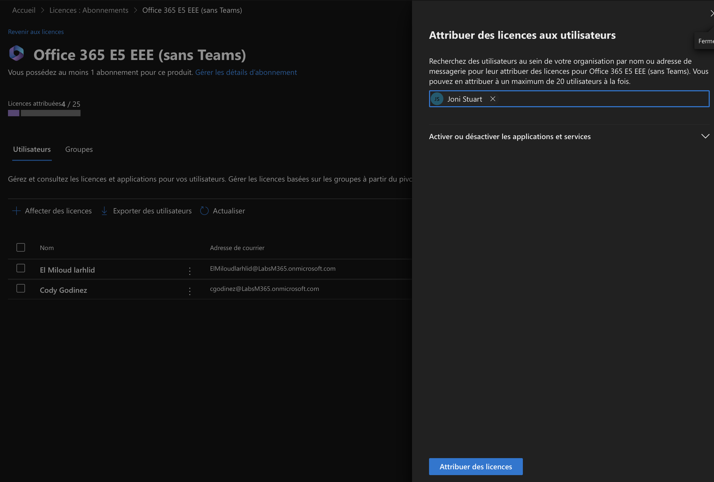
   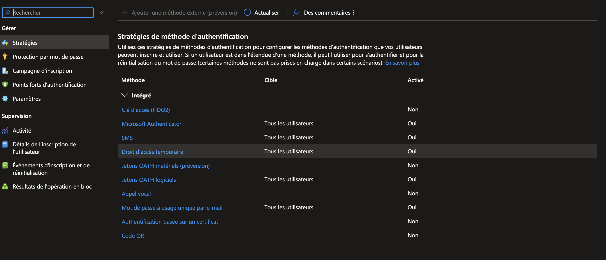
   

### Tâche 5 – Suppression d’un appareil Windows de Microsoft Entra ID
1. Sur le poste SEA-WS1, tout en étant connecté avec l’utilisateur Joni Sherman.
2. Accès à *Settings > Accounts > Access work or school.*
3. Sélection du compte Connected to Contoso’s Azure AD.
4. Sélection de l’option Disconnect, puis confirmation de l’action.

   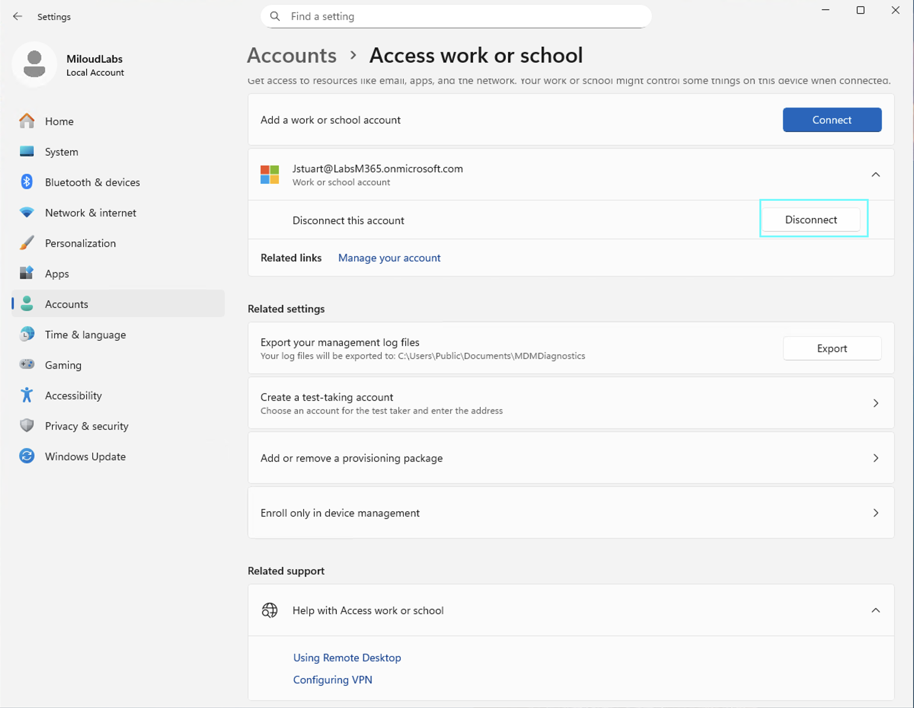
   
6. Validation de la déconnexion sur la page Disconnect from the organization.
8. Saisie des identifiants administrateur locaux (Admin) afin d’autoriser la suppression de l’appareil.
9. Redémarrage du poste pour finaliser la suppression de l’appareil de Microsoft Entra ID.

 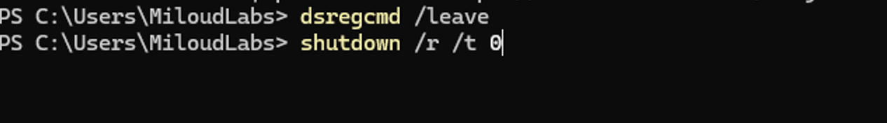

 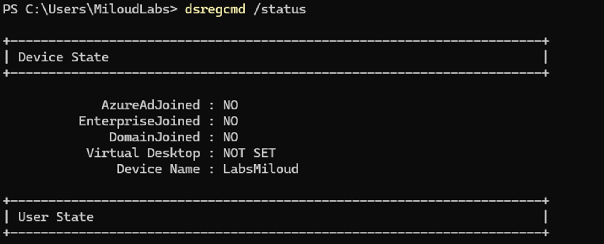

## Exercise 2 – Configuration de Microsoft Entra Hybrid Join
🎯 *Objectif*
Certains appareils Windows Contoso sont actuellement connectés aux services de domaine Active Directory locaux. Pour permettre à ces appareils d'accéder de manière transparente aux services cloud, vous prévoyez d'activer la connexion hybride Entra. Vous testerez la connexion hybride Entra en reconfigurant la synchronisation Entra Connect et en testant le processus sur SEA-CL2.

### Tâche 1 – Préparation de l’environnement (Non exécutée)
1. Accès au serveur SEA-SVR1 et ouverture de Active Directory Users and Computers.
2. Création d’une nouvelle unité d’organisation (OU) nommée Entra ID clients au niveau du domaine Contoso.com.

   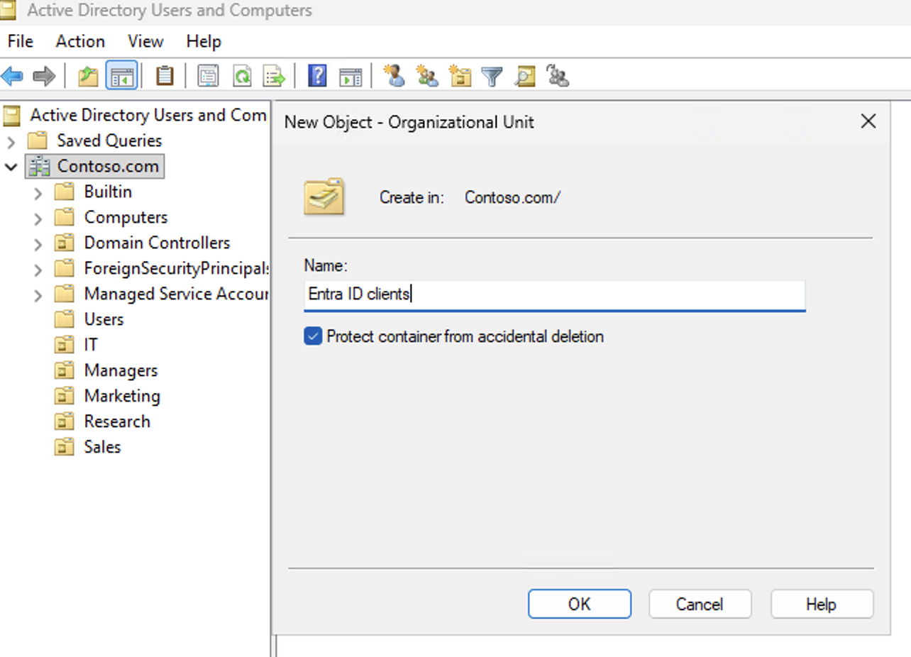
   
4. Sélection de l’ordinateur SEA-CL2 depuis l’OU Seattle Clients.

    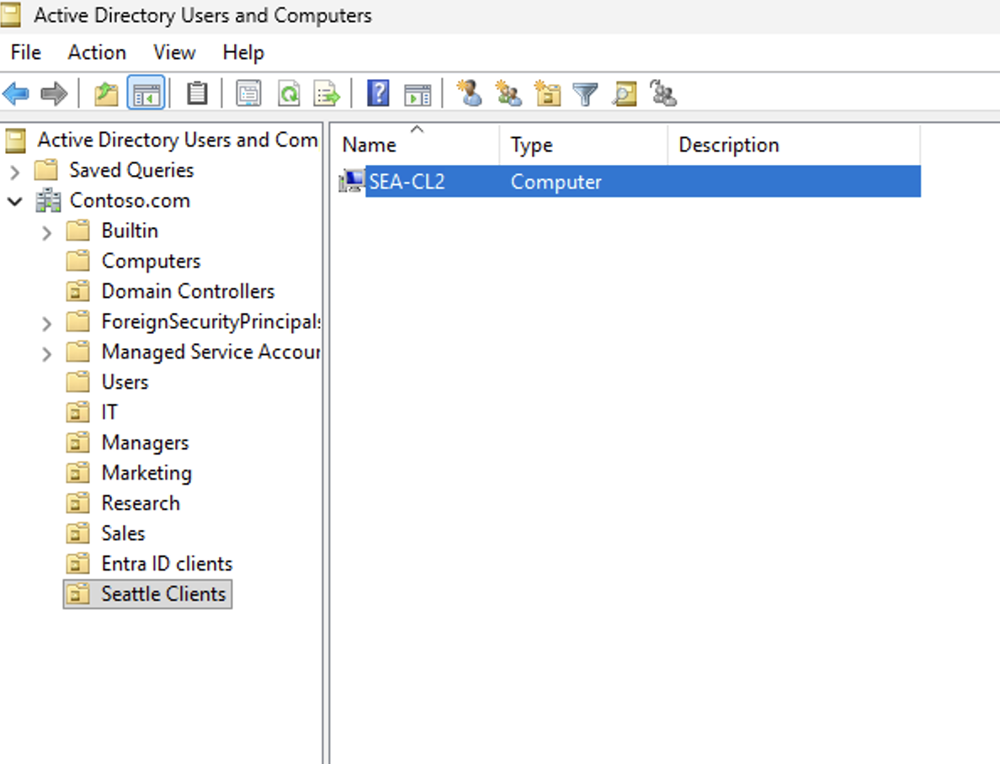
   
6. Déplacement de l’ordinateur SEA-CL2 vers l’OU Entra ID clients afin de le préparer à la synchronisation avec Microsoft Entra ID.

    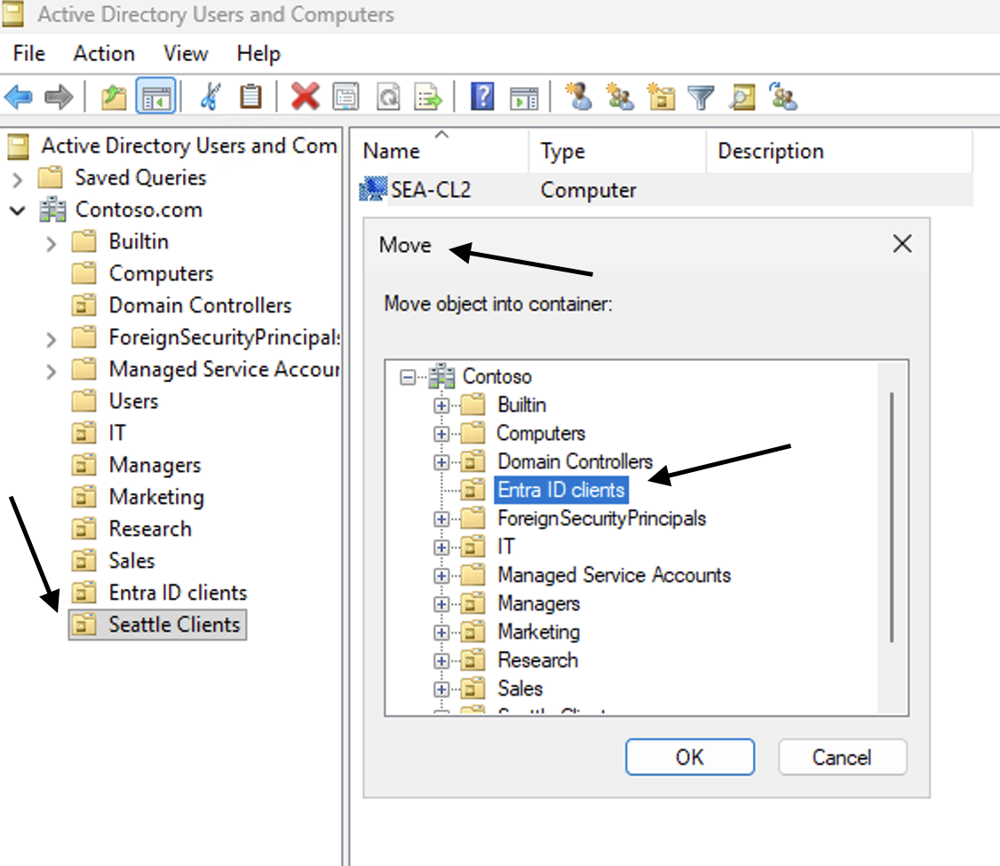
   

### Tâche 2 – Configuration du Microsoft Entra Hybrid Join via Entra Connect (Non exécutée)
1. Accès au serveur *SEA-SVR1* et lancement de Microsoft Entra Connect Sync.
2. Sélection de l’option Configure, puis Configure device options.
3. Connexion au tenant Microsoft Entra ID à l’aide d’un compte administrateur.
4. Sélection de l’option Configure Hybrid Microsoft Entra ID Join.
5. Choix des appareils Windows 10 ou ultérieurs joints au domaine comme systèmes concernés.
6. Configuration du Service Connection Point (SCP) pour le domaine Contoso.com, avec Microsoft Entra ID comme service d’authentification.
7. Validation de la configuration à l’aide des identifiants Enterprise Administrator.
8. Lancement de la configuration afin d’appliquer les paramètres Hybrid Join.
9. Redémarrage du poste SEA-CL2 pour permettre la découverte du SCP et préparer l’enregistrement Hybrid Join.
10. Connexion au poste SEA-CL2 avec un compte administrateur du domaine.

### Tâche 3 – Reconfiguration de la synchronisation Entra Connect (Non exécutée)

